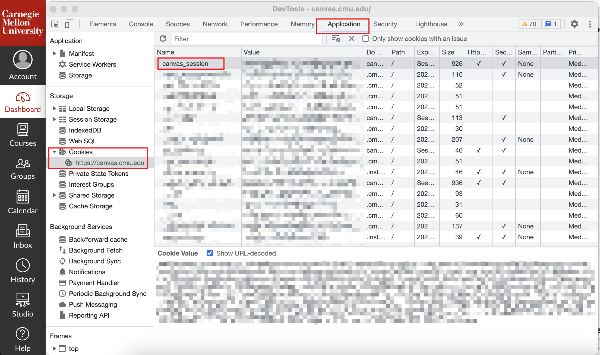
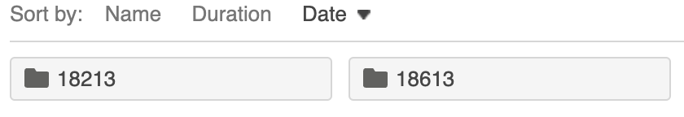

# Set up Environment

Create a Python virtual environment and install dependencies.

```bash
python3 -m venv pyvenv
source pyvenv/bin/activate

pip install -r requirements.txt
```

# Login by Cookie

Create `cookie.py` in the root folder and replace `"value": "your_cookie_value"` with your `canvas_session` cookie

```python
COOKIE = {
    "name": "canvas_session",
    "value": "your_cookie_value"
}
```

To find your `canvas_session` cookie:

* Go to your CMU Canvas homepage, open the Devtools of your browser (press F12 if
  you are using Chrome)
* Open Application panel of the Devtools, find `canvas_session` cookie in the Storage directory on the left side of the
  panel.



The value of `cavnas_session` seems to change on a daily basis. If the crawler fails to login, retry with the new cookie
value.

# Start Crawling

Specify Panopto Recordings page URL in `main.py`

```python
recordings = crawler.crawl_recordings(url="")
```

Add the `subfolder` keyword argument if there are subfolders

```python
recordings = crawler.crawl_recordings(url="", subfolder="")
```

For example,


```python
recordings = crawler.crawl_recordings(url="", subfolder="18613")
```

# Save Results

Results can only be saved in a file after calling `crawler.crawl_recordings(url)` method

Results can be saved in `result.json` file by

```python
crawler.save_result()
```

Results can also be visualized in `result.html` file by

```python
crawler.render_html()
```

# Load Results

Load crawled recordings from `result.json` file

```python
recordings = crawler.load_result()
```

# Download Videos

There are two .mp4 video files per lecture recording. The primary video file records classroom activities. The secondary
video records the slides which were played synchronously on the computer and the projector.

Syntax:

```python
crawler.download(start_index_including, num)
```

For example:

```python
crawler.download(1, 3)
```

Code above will download videos of 3 lectures (so 6 .mp4 video files)  with indices of 1, 2, 3. Index starts from 1 and includes 1.

# Headless

Enabling headless will automate the browser in the background.

```python
crawler = Crawler(headless=True)
```

# Run the Script
```bash
python main.py
```